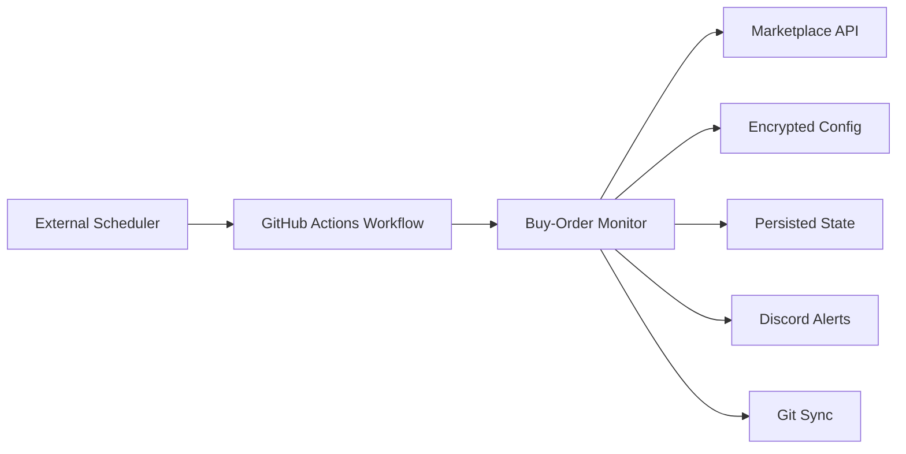
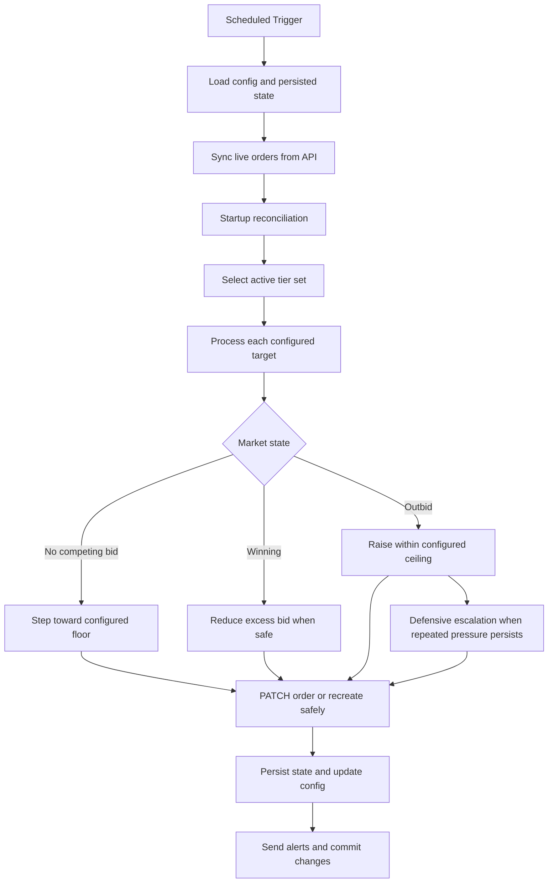
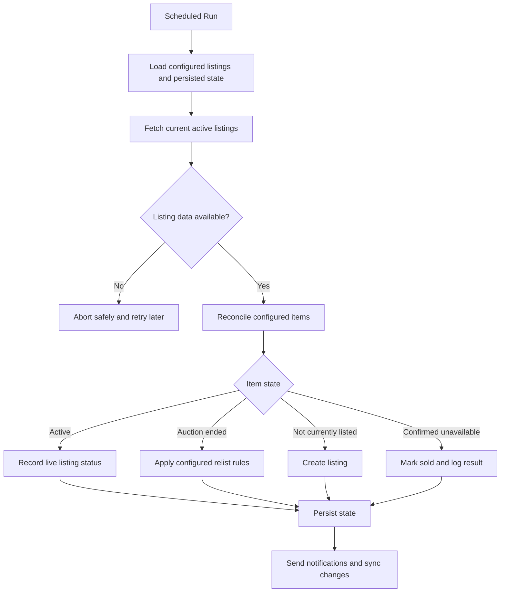
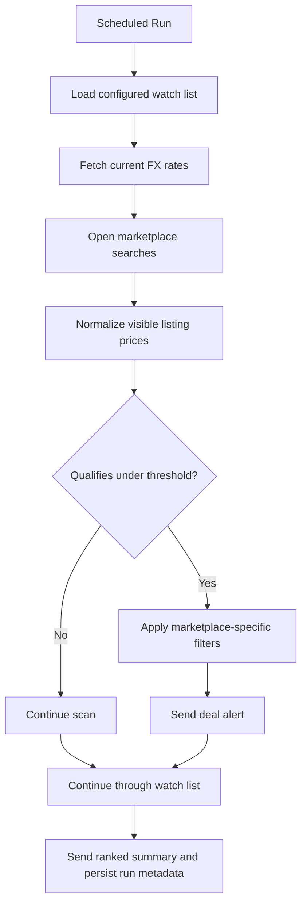

# CS2 Marketplace Trading System

A production Python automation suite for monitoring CS2 marketplace opportunities, managing buy orders, and supporting related listing and price-alert workflows.

The project is built around resilient scheduled execution rather than a continuously running local process: state is persisted between runs, market actions are rate-aware, and the bot is designed to recover cleanly from API failures, expired orders, and interrupted jobs.

## System Overview



## Buy-Order Monitor

The bid monitor maintains a bounded set of configured market targets and keeps orders competitive without exceeding item-specific risk limits.



### Core behavior

| Capability | Description |
|---|---|
| Competitive repricing | Raises bids only as needed to remain competitive within a configured ceiling |
| Capital efficiency | Lowers bids when the bot is winning by more than needed |
| Bounded risk | Enforces per-item minimum and maximum bid limits before writes are sent |
| Market-aware ceilings | Periodically checks comparable buy-now listings and temporarily lowers an item's active ceiling when the live market falls below the configured maximum |
| Defensive recovery | Handles repeated competitive pressure with configurable stepped escalation and gradual recovery |
| Multi-target awareness | Supports a single configured order covering several linked marketplace targets while ignoring branches that are no longer economically winnable |
| Tiered scheduling | Routes active, moderate, and quiet targets through hot / mid / cold tiers so expensive checks are concentrated where they matter most |
| Stateful reconciliation | Restores continuity across scheduled runs, recreates missing orders when appropriate, and prunes stale state for removed targets |

### Market safety

The monitor also performs a separate comparable-market safety check. When valid live listings move below a configured ceiling, it can temporarily tighten that ceiling and surface the cheaper listing for review, helping keep automated bids aligned with the current market rather than relying only on static configuration.

### Tier model

The monitor can run in one of four modes:

| Mode | Purpose |
|---|---|
| `cycle` | Normal mode. Processes hot every trigger and periodically includes mid and cold according to configured cadence |
| `hot` | Only active/high-priority targets |
| `mid` | Only medium-priority targets |
| `cold` | Only low-frequency targets |

Tier promotion and demotion are automatic and stateful. Listings move between tiers based on recent activity signals, while pre-move and post-move checks ensure a listing is present in exactly one tier file at a time.

## Reliability and Safety

| Area | Safeguard |
|---|---|
| Rate limits | Adaptive pacing, exponential backoff, persisted cooldowns, and one-shot slow-run skips |
| Long runs | Workflow overlap protection plus an internal watchdog |
| Order writes | PATCH-first updates with guarded delete-and-recreate fallback |
| Market drift | Resumable comparable-market scans that temporarily tighten bid ceilings when lower valid buy-now listings appear |
| Config mutations | Atomic writes, backup snapshots, and verification around tier moves |
| State mutations | Atomic JSON persistence and stale-key pruning for removed listings |
| Observability | Discord alerts for bid changes, cooldowns, watchdog exits, summary updates, and cheaper comparable-listing discoveries |
| Security | Secrets supplied by environment variables / GitHub Actions secrets; repository contents encrypted at rest with `git-crypt` |

## Project Layout

```text
.
|-- config/
|   |-- listings.py
|   |-- listings_hot.py
|   |-- listings_mid.py
|   `-- manual_bids.py
|-- data/
|   |-- state.json
|   `-- outbid_stats.json
|-- sandbox/
|   |-- runner.py
|   `-- test_listings.py
|-- src/
|   `-- market_monitor/
|       |-- monitor.py
|       |-- monitor_market.py
|       |-- monitor_processing.py
|       |-- monitor_runtime.py
|       |-- monitor_tiers.py
|       |-- listing_loader.py
|       |-- strategy_settings.py
|       `-- ...
|-- main.py
`-- test_file.py
```

### Key files

| Path | Role |
|---|---|
| `main.py` | Stable entrypoint for normal runs |
| `config/listings*.py` | Live tiered configuration |
| `src/market_monitor/strategy_settings.py` | Global tuning controls for cadence, recovery, and runtime protection |
| `data/state.json` | Persisted operational state |
| `data/outbid_stats.json` | Historical outbid counters |
| `sandbox/test_listings.py` | Isolated live-test input file |
| `test_file.py` | Compatibility entrypoint for sandbox runs |

## Running

### Normal monitor run

```bash
python main.py
```

### Sandbox run

```bash
python test_file.py
```

The sandbox uses real marketplace order behavior for entries in `sandbox/test_listings.py`, while intentionally skipping live tier promotion/demotion, bid-war state changes, Discord notifications, and global cleanup tasks.

### Saved losing-bid report

```bash
python show_losing_bids.py
```

Optionally filter the report to one tier:

```bash
python show_losing_bids.py --tier hot
python show_losing_bids.py --tier mid
python show_losing_bids.py --tier cold
```

This is a read-only report built from the latest persisted hot, mid, and cold
run data in `data/state.json`. It makes no API calls, does not run the monitor,
does not modify state or config, and does not create or save report files.

### GitHub Actions

The workflow supports manual tier selection through `workflow_dispatch`:

- `cycle` (default)
- `hot`
- `mid`
- `cold`

The external scheduler can continue triggering the same workflow endpoint; normal unattended execution uses `cycle`.
The external trigger currently runs every 15 minutes. Hot bidding runs every
trigger, while internal cycle counts keep mid at 90 minutes and cold at 3
hours. Every invocation performs a lightweight live-quantity reconciliation
across all tiers before normal tier processing. Runs lasting at least 10
minutes arm a one-shot skip for the next external trigger.

## Additional Components
### Auto-Lister

The auto-lister is a separate scheduled workflow for maintaining owned inventory listings after purchase. It is intentionally isolated from the buy-order monitor: the bid system decides what to acquire, while the lister manages configured items that are already in inventory.



#### Core behavior

| Capability | Description |
|---|---|
| Scheduled relisting | Recreates configured listings when auctions expire or an item is not currently listed |
| Configured pricing rules | Supports per-item relist controls, including optional step-down behavior and price floors |
| Stateful reconciliation | Tracks active listings, pending sale context, and failure history across runs |
| Sale confirmation | Treats an item as sold only after repeated explicit unavailable-in-inventory responses |
| Failure-aware execution | Skips relisting when listing-state fetches fail, avoiding unsafe assumptions during API outages |
| Durable persistence | Uses atomic writes for operational state and bot-managed config updates |
| Sale logging | Records confirmed sales into a separate tracking workflow while preserving failed manual entries for retry |

#### Design notes

The lister is built around conservative recovery rather than aggressive automation. It does not infer sales from generic API failures, and it keeps listing definitions separate from transient runtime state so scheduled runs can resume cleanly after interruptions. Pricing behavior remains item-configurable, while implementation details and marketplace-specific thresholds are intentionally kept out of the public documentation.

### Marketplace Watchers



#### Core behavior

| Capability | Description |
|---|---|
| Scheduled scanning | Checks configured marketplace searches on a recurring schedule without requiring a continuously running local process |
| Price normalization | Converts observed listing prices into a common comparison currency before threshold checks |
| Per-item thresholds | Uses explicit watch-list limits so each tracked sticker or search can be evaluated independently |
| Marketplace-specific filtering | Applies source-specific validation such as visible listing parsing, manual-review workflows, or sticker-condition checks where available |
| Discord reporting | Sends qualifying opportunity alerts and ranked summaries for later review |
| Durable run metadata | Persists lightweight historical counters and other workflow-specific state between scheduled runs |

| Component | Role | Runtime |
|---|---|---|
| Skinport | Automated watch-list scanning with marketplace price normalization and alerting (auto rebases price) | Windows Task Scheduler |
| CS.Money | Supplemental marketplace checks and Discord alerting for watched opportunities (auto rebases price) | Windows Task Scheduler |
| Steam Community Market | Scheduled marketplace search monitoring with currency normalization, sticker-condition filtering, and ranked deal summaries (auto rebases price) | GitHub Actions |
| BUFF | Scheduled marketplace search monitoring with currency normalization, sticker-condition filtering, and ranked deal summaries (auto rebases price) | Hidden |

These components extend the system beyond the core marketplace buy-order monitor while remaining separate from its bidding loop and state machine.

## Notes

- The repository intentionally keeps detailed pricing heuristics in code/config rather than documentation.
- Operational behavior is tuned through configuration files and centralized settings, allowing the system to evolve without rewriting the core monitor.
- The design favors recoverability, bounded risk, and auditability over maximum request volume.
