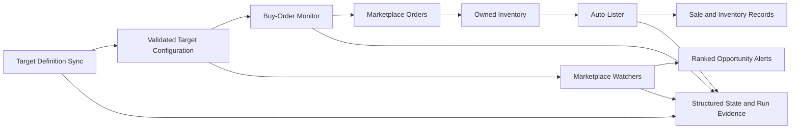
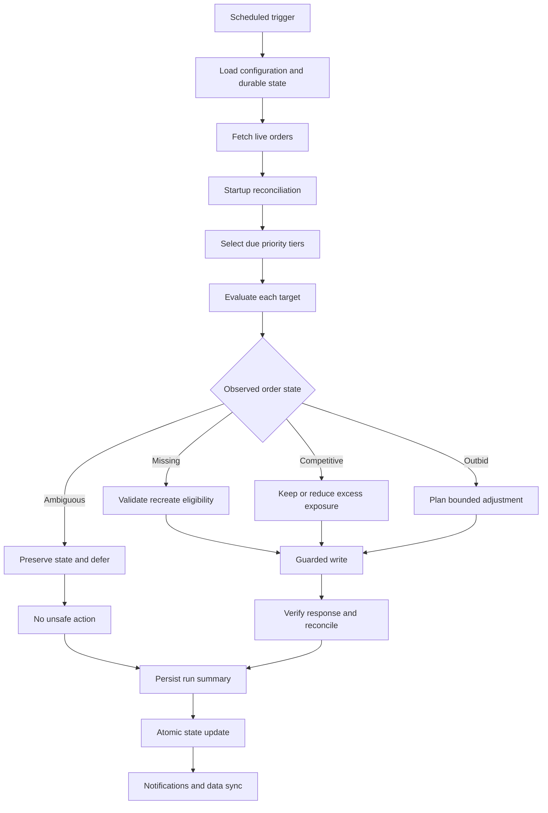
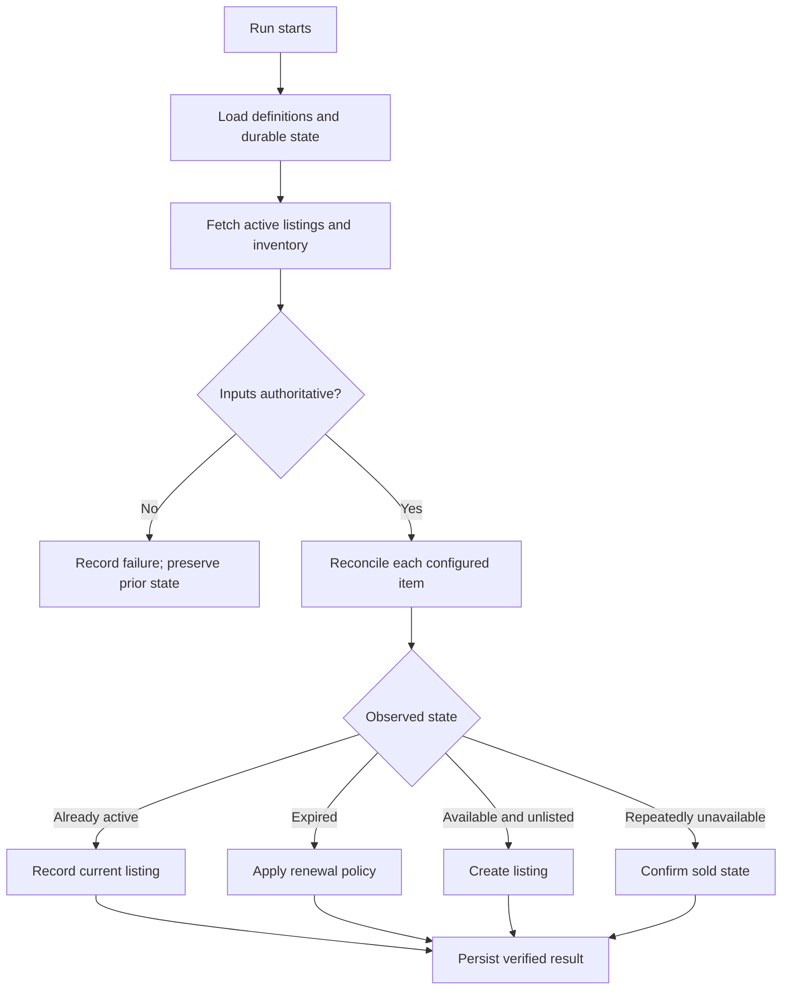

# CS2 Marketplace Trading System

CS2 Marketplace Trading System is a modular automation platform for maintaining
marketplace buy orders, monitoring configured opportunities, publishing updated
target definitions, and managing inventory after acquisition.

This repository contains the core buy-order monitor. The broader system also
includes focused companion services for auto-listing, marketplace discovery,
and target-file synchronization. Each service owns a narrow responsibility and
produces durable run evidence so failures remain isolated and diagnosable.

## System overview



The components exchange validated configuration and structured results rather
than sharing browser sessions or mutable runtime state. A watcher failure
therefore cannot erase order state, and a listing failure cannot interrupt the
buy-order monitor.

## Component map

| Component | Responsibility | Execution model |
| --- | --- | --- |
| Buy-Order Monitor | Reconcile, create, reprice, and retire configured marketplace orders | Scheduled Python workflow |
| Auto-Lister | Reconcile owned inventory, create or renew listings, and confirm sales conservatively | Scheduled browser/API workflow |
| Skinport + CS.Money Finder | Scan configured targets, normalize results, and publish ranked alerts | Daily two-stage browser workflow |
| Steam Market Watcher | Evaluate additional marketplace opportunities with currency and condition normalization | Scheduled workflow |
| BUFF Watcher | Optional source adapter retained behind an explicit enable/disable control | Disabled by default |
| Target Definition Sync | Validate and publish the target files consumed by the other components | Daily configuration workflow |

## 1. Core buy-order monitor

The monitor maintains a bounded set of configured targets. Each run loads
durable state, reconciles it against authoritative live orders, selects the
appropriate priority tier, and decides whether an order should be left
unchanged, adjusted, recreated, or retired.



### Bid lifecycle

| Phase | Behavior |
| --- | --- |
| Startup | Load configuration, validate state shape, and fetch authoritative live orders |
| Reconciliation | Match configured targets to live orders while preserving ambiguous or in-flight state |
| Tier selection | Concentrate expensive checks on active targets and rotate quieter targets less frequently |
| Market evaluation | Compare current competition, comparable listings, and target-specific safety bounds |
| Action planning | Prefer the smallest valid update and avoid unnecessary cancel/recreate cycles |
| Write verification | Treat the remote response and later reconciliation as authoritative evidence |
| Persistence | Atomically save state, summaries, cooldowns, and tier movement |
| Finalization | Publish notifications and safely synchronize bot-managed data |

### Tiered scheduling

Targets move among hot, mid, and cold tiers based on recent activity. The cycle
runner gives active targets priority while periodically including quieter
tiers. Pre-move and post-move validation require each target to appear in
exactly one tier, preventing duplicate orders and silent omissions.

| Mode | Purpose |
| --- | --- |
| `cycle` | Normal unattended scheduling across all due tiers |
| `hot` | Active and high-priority targets only |
| `mid` | Medium-frequency targets only |
| `cold` | Low-frequency targets only |

### Market-aware protection

The monitor can compare valid buy-now listings with the current order plan and
temporarily tighten exposure when the visible market changes. Missing,
incomplete, or invalid comparison data fails closed rather than authorizing a
wider bid. An ambiguous write outcome is preserved for reconciliation instead
of being blindly retried.

## 2. Auto-lister

The auto-lister takes over after acquisition. It compares configured inventory
with authoritative active-listing and inventory responses, then creates,
maintains, renews, or retires listings conservatively.



The lister never infers a sale from a generic API or browser failure. Missing
inventory requires repeated explicit evidence, while failed or incomplete
reads leave the previous state intact. Bot-managed files are written
atomically and synchronized only after the run reaches a verified terminal
state.

## 3. Marketplace watchers

The watcher layer searches several CS marketplaces for configured
opportunities. Although each source adapter differs, the services share one
high-level contract:

```text
load targets -> fetch source -> normalize currency and item identity
             -> validate source-specific requirements -> rank results
             -> publish alerts -> write structured completion evidence
```

### Skinport and CS.Money finder

The daily finder contains two independently runnable stages. It can scan both
sources together or resume only the unfinished stage after an interruption.
Its completion artifact records the selected mode, completed checks,
authentication health, source-level errors, alert counts, and final status.

This split-stage design prevents a late failure from repeating already
completed browser work and makes partial recovery explicit rather than
guessing from the last log line.

### Steam market watcher

This workflow normalizes currency, evaluates configured item and condition
requirements, ranks qualifying results, and publishes a compact summary. Its
state and failures are isolated from order maintenance, so an alerting outage
does not alter active bids.

### BUFF watcher

The BUFF adapter is retained as an optional integration but is disabled by
default. Disabled means the workflow is not inspected, launched, or included
as a completion dependency until it is explicitly enabled.

## 4. Target definition sync

Target configuration changes independently from runtime code. A dedicated
daily workflow validates source definitions and publishes deterministic target
files consumed by the buy-order monitor and watchers.

The sync process:

1. reads the current source definitions;
2. validates required fields, types, uniqueness, and supported names;
3. generates deterministic target configuration;
4. verifies the generated files before replacement;
5. atomically publishes the update;
6. records a timestamped completion result;
7. synchronizes changes only after validation succeeds.

Separating definition maintenance from transaction processes reduces the risk
that a malformed target update reaches a live workflow.

## Reliability model

| Failure condition | System response |
| --- | --- |
| Missing or malformed configuration | Reject the run before marketplace writes |
| Incomplete source response | Preserve prior state and record a failed/incomplete result |
| Unknown order or listing outcome | Keep the item uncertain and refuse a duplicate submission |
| Authentication failure | Record an actionable failure without claiming successful work |
| Interrupted multi-stage scan | Preserve completed-stage evidence and resume only unfinished work |
| Missing or corrupt state | Restore a validated backup when available; otherwise fail closed |
| Repeated item absence | Require corroborating evidence before recording a sale |
| Optional component disabled | Exclude it completely from execution and completion requirements |

### State, logs, and completion evidence

The system distinguishes three evidence layers:

- **durable runtime state** for reconciliation context, pending work, and last
  known authoritative observations;
- **structured run artifacts** containing explicit status, timestamps, mode,
  counts, and failure classifications;
- **human-readable logs** for detailed decisions and diagnostics.

A process launch or a single log message is not treated as proof of successful
work. Completion is based on a terminal run artifact plus internally
consistent counts and timestamps. Logs remain supporting evidence and make
failures explainable without becoming the only source of truth.

### Persistence safety

- State replacement is atomic where practical.
- Previous known-good snapshots are retained for recovery.
- Generated configuration is validated before publication.
- Ambiguous remote writes remain pending until reconciliation.
- Data synchronization occurs only after a completed run boundary.
- Runtime secrets and account-specific values remain outside public source.

## Technology

- Python for orchestration, state transitions, data validation, APIs, and
  testing;
- JavaScript/Node.js for selected browser-driven workflows;
- Playwright and Selenium for isolated browser adapters;
- REST APIs for orders, listings, pricing, and inventory;
- GitHub Actions and controlled local launchers for scheduled execution;
- structured JSON/JSONL artifacts and atomic files for run history;
- Git-based configuration and validated data synchronization.

## Repository layout

The checked-in code in this repository is the core buy-order monitor and its
supporting utilities.

```text
.
├── .github/                         # Scheduled and manual workflows
├── config/
│   ├── listings.py                  # Primary configured targets
│   ├── listings_hot.py              # Active tier
│   ├── listings_mid.py              # Medium-frequency tier
│   └── manual_bids.py               # Explicit manual entries
├── data/
│   ├── state.json                   # Durable monitor state
│   └── outbid_stats.json            # Competitive-pressure history
├── sandbox/
│   ├── runner.py
│   └── test_listings.py
├── src/market_monitor/
│   ├── monitor.py                   # Main orchestration
│   ├── monitor_market.py            # Market reads and comparison
│   ├── monitor_processing.py        # Per-target decisions
│   ├── monitor_runtime.py           # Runtime and watchdog boundaries
│   ├── monitor_tiers.py             # Tier movement and validation
│   ├── listing_loader.py            # Configuration loading and normalization
│   └── strategy_settings.py         # Central runtime controls
├── export_bid_prices.py
├── show_losing_bids.py
├── sync_quantities.py
├── main.py
└── test_file.py
```

## Running the core monitor

Install dependencies in an isolated environment, provide required runtime
configuration through environment variables, and use the stable entrypoint:

```bash
python main.py
```

Run the isolated sandbox entrypoint:

```bash
python test_file.py
```

Generate a read-only losing-bid report from persisted state:

```bash
python show_losing_bids.py
python show_losing_bids.py --tier hot
python show_losing_bids.py --tier mid
python show_losing_bids.py --tier cold
```

The report performs no marketplace writes and does not modify state or
configuration.

## Security and public scope

Credentials are supplied through runtime secrets, not source files. Sensitive
configuration remains outside public documentation and is protected by the
repository's existing encrypted/configuration workflow. This README describes
system boundaries and safety properties without publishing account details,
private identifiers, bid values, or strategy thresholds.

The design prioritizes recoverability, bounded risk, failure isolation, and an
auditable explanation for every automated decision.
