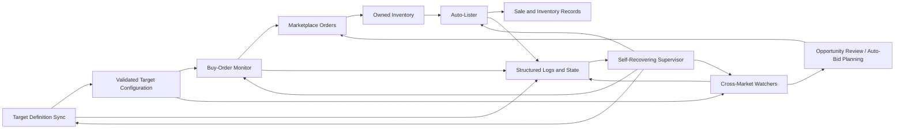
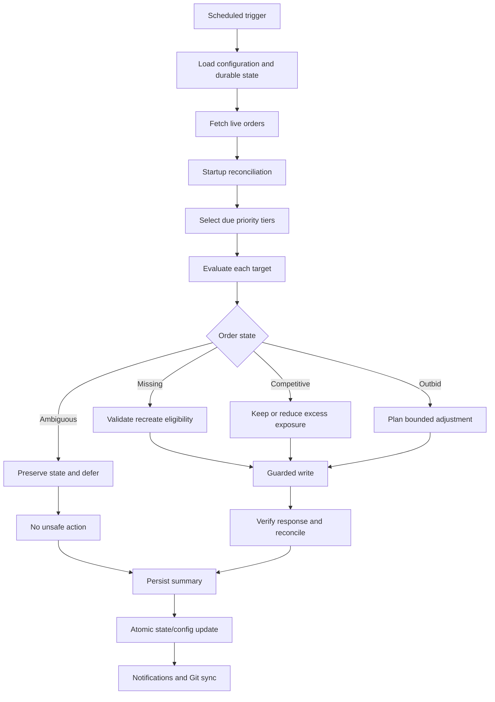
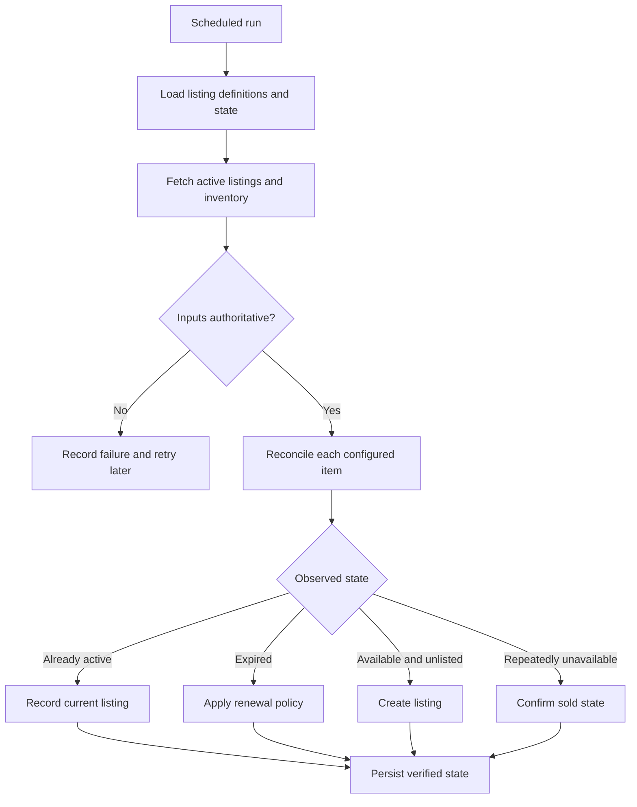

# CS2 Marketplace Trading System

CS2 Marketplace Trading System is a multi-service automation platform for
finding opportunities, maintaining competitive buy orders, tracking newly
configured targets, and managing inventory after acquisition.

This repository contains the core scheduled buy-order monitor. The complete
system also includes companion services for auto-listing, cross-market deal
discovery, target-definition synchronization, and self-recovering process
orchestration. Together they form one pipeline from discovery to bidding,
inventory management, sale tracking, and operational recovery.

## Platform overview



The platform is deliberately modular. A failed watcher does not stop the
buy-order monitor, and an auto-lister outage does not erase bidding state. The
supervisor observes each service independently and uses global shutdown only
for global conditions such as unsafe host activity, connectivity loss, sleep,
or an operator-selected stop-all action.

## Component map

| Component | Responsibility | Typical runtime | Repository boundary |
| --- | --- | --- | --- |
| Buy-Order Monitor | Reconcile, create, reprice, and retire configured marketplace orders | GitHub Actions / scheduled Python | This repository |
| Cross-Market Auto Buyer | Scan current listings, verify identity, rank opportunities, and guard transaction submission | Long-running supervised process | Companion private service |
| Bargain Buy-Order Explorer | Analyze seller offers, pending orders, demand support, and pump-like market shape | Long-running supervised process | Companion private service |
| Auto-Lister | Reconcile owned inventory, create or renew listings, and confirm sales conservatively | Windows scheduled workflow | Companion private service |
| Skinport + CS.Money Finder | Scan configured targets, normalize prices, and publish ranked alerts | Daily browser workflow | Companion private service |
| Steam Market Watcher | Monitor additional marketplace opportunities with currency and condition normalization | GitHub Actions | Companion workflow |
| BUFF Watcher | Optional/disabled source adapter retained behind an explicit project control | Disabled until enabled | Companion workflow |
| Target Definition Sync | Validate and publish the latest target files used by bidders and watchers | Daily scheduled workflow | Companion configuration service |
| Self-Recovering Supervisor | Coordinate terminals, priorities, recovery, cooldowns, and verified shutdown | Windows logon task | Companion control plane |

Public architectural demonstrations are available in
[Marketplace Price Tracker](https://github.com/ChardXBT/Marketplace-Price-Tracker)
and
[Self-Recovering Automation](https://github.com/ChardXBT/Self-Recovering-Automation).

## 1. Core buy-order monitor

The monitor maintains a bounded set of configured targets. Each scheduled run
loads durable state, reconciles it against live orders, selects the appropriate
priority tier, and decides whether an order should be left unchanged, adjusted,
recreated, or retired.



### Bid lifecycle

| Phase | Behavior |
| --- | --- |
| Startup | Load configuration, validate state schema, and fetch authoritative live orders |
| Reconciliation | Match configured targets to live orders and preserve ambiguous or in-flight state |
| Tier selection | Concentrate expensive checks on active targets while rotating quieter targets less frequently |
| Market evaluation | Compare current competition, live comparable listings, and target-specific safety bounds |
| Action planning | Prefer the smallest valid update and avoid unnecessary cancel/recreate cycles |
| Write verification | Treat the remote response and subsequent reconciliation as the source of truth |
| Persistence | Atomically save state, summaries, cooldowns, and tier movement |
| Finalization | Publish notifications and safely synchronize bot-managed data |

### Tiered scheduling

Targets move among hot, mid, and cold tiers based on recent market activity.
The cycle runner always gives active targets priority while periodically
including quieter tiers. Pre-move and post-move validation ensure a target is
present in exactly one tier, preventing duplicated orders or silent omissions.

Supported execution modes:

| Mode | Purpose |
| --- | --- |
| `cycle` | Normal unattended scheduling across all due tiers |
| `hot` | Active and high-priority targets only |
| `mid` | Medium-frequency targets only |
| `cold` | Low-frequency targets only |

### Market-aware protection

The monitor does not rely only on static configuration. It can compare valid
buy-now listings with the current order plan, temporarily tighten exposure when
the visible market moves, and resume normal configuration only after the market
state is consistent. Invalid, missing, or incomplete comparable data fails
closed rather than authorizing a wider bid.

## 2. Cross-market auto buyer

The auto-buyer is a separate live service optimized for current listings rather
than resting buy orders. It normalizes listing data, requires an exact item
identity, scores the opportunity, and revalidates immediately before any
transaction adapter is allowed to act.

Key safeguards include:

- one durable identity per candidate;
- duplicate-submission barriers across concurrent workers;
- bounded purchase concurrency;
- separation between definitive rejection and unknown transaction outcome;
- no blind retry after a timeout or ambiguous response;
- browser fallback only after fresh listing revalidation;
- graceful pause that waits for already-sent requests to resolve;
- transaction evidence written before the candidate can be reconsidered.

The public [Marketplace Price Tracker](https://github.com/ChardXBT/Marketplace-Price-Tracker)
shows a non-executable version of the normalization and planning boundary.

## 3. Bargain buy-order explorer

The buy-order explorer evaluates seller offers and demand depth rather than
only comparing visible ask prices. It reconciles existing pending offers,
inspects market support, and avoids submitting another order when an equivalent
offer is already active or its outcome is uncertain.

Its pump-risk check evaluates normalized market shape:

- depth close to the reference region;
- concentration in the largest visible level;
- breadth across multiple price levels;
- whether apparent demand is supported broadly or dominated by a narrow peak;
- consistency between recent price movement and visible order support.

An elevated or ambiguous result produces a hold/review outcome, not an
automatic bid. Detailed production thresholds and marketplace request logic
remain private.

## 4. Auto-lister

The auto-lister takes over after acquisition. It compares configured inventory
with authoritative active listings and inventory responses, then creates,
maintains, renews, or retires listings conservatively.



The lister never infers a sale from a generic API failure. Missing inventory is
confirmed through repeated explicit evidence, while fetch failures leave the
prior state intact. Bot-managed state and listing definitions are saved
atomically and synchronized only after a completed run.

## 5. Marketplace watchers

The watcher layer searches several marketplaces for configured opportunities.
Although the source adapters differ, each follows the same contract:

```text
load targets -> fetch source -> normalize currency and item identity
             -> apply source-specific validation -> rank results
             -> publish alerts -> write structured completion proof
```

### Skinport and CS.Money finder

One daily browser workflow contains two independently runnable halves. It can
scan both sources together or resume only the unfinished half after an
interruption. A combined completion artifact records which mode ran, how many
checks completed, whether authentication remained valid, and any source-level
errors.

### Steam market watcher

This scheduled workflow normalizes currency, evaluates configured item and
condition requirements, ranks qualifying results, and publishes a summary. It
is isolated from the live bidders so an alerting failure cannot interrupt order
maintenance.

### BUFF watcher

The BUFF adapter remains explicitly disabled in the supervisor project-control
file. Disabled means ignored: it is not inspected, launched, stopped, or used
as a completion dependency until an operator enables it.

## 6. Target definition sync

Target configuration changes independently from runtime code. A dedicated
daily job validates the latest source definitions and publishes the generated
target files consumed by bidders and watchers.

The sync workflow:

1. reads the current source definitions;
2. validates required fields, types, uniqueness, and supported names;
3. generates deterministic target configuration;
4. verifies the generated files before replacement;
5. atomically publishes the update;
6. records a timestamped completion result;
7. commits and pushes only after validation succeeds.

This separates configuration maintenance from transaction processes and gives
the supervisor a clear success artifact to inspect each day.

## 7. Self-recovering supervisor

The supervisor is the platform control plane. It hosts interactive terminals
when available, falls back to read-only logs when terminal hosting fails, and
uses one priority/capacity queue across live and scheduled projects.

### Responsibilities

- prevent duplicate processes and duplicate scheduled starts;
- prioritize continuous live services without starving due batch work;
- defer launches while the machine is busy, on unsafe battery state, or
  recovering from a connectivity failure;
- classify temporary failures separately from durable repair-required states;
- apply cooldowns without leaving a project off forever;
- detect whether a scheduled process actually completed meaningful work;
- preserve unclean-shutdown evidence and perform sequential recovery;
- request cooperative shutdown and wait for commit/save/clean-exit proof;
- keep disabled projects completely outside automation decisions;
- provide structured operator-visible reasons for every start, stop, or hold.

### Recovery contract

```text
UNCLEAN START
   -> validate mirrored state
   -> inspect live processes and completion evidence
   -> reconcile uncertain work one project at a time
   -> verify connectivity and host safety windows
   -> restore eligible live services by priority
   -> run overdue scheduled jobs within capacity
   -> clear recovery marker only after consistency is proven
```

The public [Self-Recovering Automation](https://github.com/ChardXBT/Self-Recovering-Automation)
repository demonstrates the state-machine and queue concepts without private
integrations.

## Shared reliability model

| Failure | Platform response |
| --- | --- |
| One service exits | Isolate that service; keep unrelated services running |
| Process exits without proof | Mark incomplete and retry under bounded policy |
| Temporary source/driver failure | Cooldown and retry without requiring a code change |
| Authentication or durable account issue | Hold that project for explicit repair |
| Network disconnect | Pause live work, persist state, and require stable recovery |
| High host activity | Soft-stop affected automation after a sustained window |
| Missing or corrupt state | Recover from validated backup or fail closed |
| Unknown transaction outcome | Preserve uncertainty and refuse duplicate submission |
| Shutdown request | Soft-stop, wait for commit/save markers, then verify exact exit |
| Disabled project | Do not inspect, launch, stop, or include in dependencies |

No component relies on a force-kill path for normal lifecycle management.

## State, logs, and completion proof

The platform distinguishes three kinds of evidence:

- **runtime state** — current cooldowns, reconciliation context, and pending
  work;
- **structured run artifacts** — explicit success, failure, counts, run mode,
  and timestamps;
- **human-readable logs** — detailed decisions and diagnostics.

Logs are useful supporting evidence but are not the only source of truth. The
supervisor also checks process identity, structured artifacts, timestamps,
state transitions, and repository changes before deciding that a job ran or a
repair was made.

## Scheduling and priority

The system combines GitHub Actions, Windows Task Scheduler, and long-running
supervised processes. Scheduled jobs receive a due time plus a grace window so
an existing external task has time to start first. If it does not, the
supervisor starts the same job through its own validated launcher.

The queue uses:

- project priority;
- estimated resource weight;
- current CPU, memory, browser, battery, and user-idle state;
- conflicts between jobs that share a browser profile or data source;
- live-process priority;
- daily attempt and cooldown limits.

Only work that fits current capacity starts. When one job completes, the queue
re-evaluates and admits the next eligible project.

## Technology

Across the platform:

- Python for state machines, scheduled workflows, APIs, persistence, and tests;
- JavaScript/Node.js for browser-driven live monitoring;
- Playwright and Selenium for isolated browser adapters;
- REST APIs for orders, listings, and inventory;
- GitHub Actions and Windows Task Scheduler for scheduled execution;
- structured JSON/JSONL, atomic files, and repository-backed run history;
- terminal UI tooling for the integrated operator console;
- Git-based configuration and data synchronization.

## This repository

The checked-in code here is the core buy-order monitor and its supporting
utilities.

```text
.
├── .github/                         # Scheduled and manual workflows
├── config/
│   ├── listings.py                  # Primary configured targets
│   ├── listings_hot.py              # Active tier
│   ├── listings_mid.py              # Medium-frequency tier
│   └── manual_bids.py               # Explicit manual entries
├── data/
│   ├── state.json                   # Durable monitor state
│   └── outbid_stats.json            # Competitive-pressure history
├── sandbox/
│   ├── runner.py
│   └── test_listings.py
├── src/market_monitor/
│   ├── monitor.py                   # Main orchestration
│   ├── monitor_market.py            # Market reads and comparison
│   ├── monitor_processing.py        # Per-target decisions
│   ├── monitor_runtime.py           # Runtime and watchdog boundaries
│   ├── monitor_tiers.py             # Tier movement and validation
│   ├── listing_loader.py            # Config loading and normalization
│   └── strategy_settings.py         # Central runtime controls
├── export_bid_prices.py
├── show_losing_bids.py
├── sync_quantities.py
├── main.py
└── test_file.py
```

## Running the core monitor

Install dependencies in an isolated environment, provide the required runtime
configuration through environment variables, and use the stable entrypoint:

```bash
python main.py
```

Run the isolated sandbox entrypoint:

```bash
python test_file.py
```

Generate a read-only losing-bid report from persisted state:

```bash
python show_losing_bids.py
python show_losing_bids.py --tier hot
python show_losing_bids.py --tier mid
python show_losing_bids.py --tier cold
```

The report performs no marketplace writes and does not modify state or
configuration.

## Security and public scope

Credentials are supplied through runtime secrets, not source files. Sensitive
configuration is kept outside the public documentation and protected by the
repository's existing encrypted/configuration workflow. This README describes
system boundaries and safety properties without publishing account details,
private identifiers, bid values, or production strategy thresholds.

The design prioritizes recoverability, bounded risk, failure isolation, and an
auditable explanation for every automated decision.
