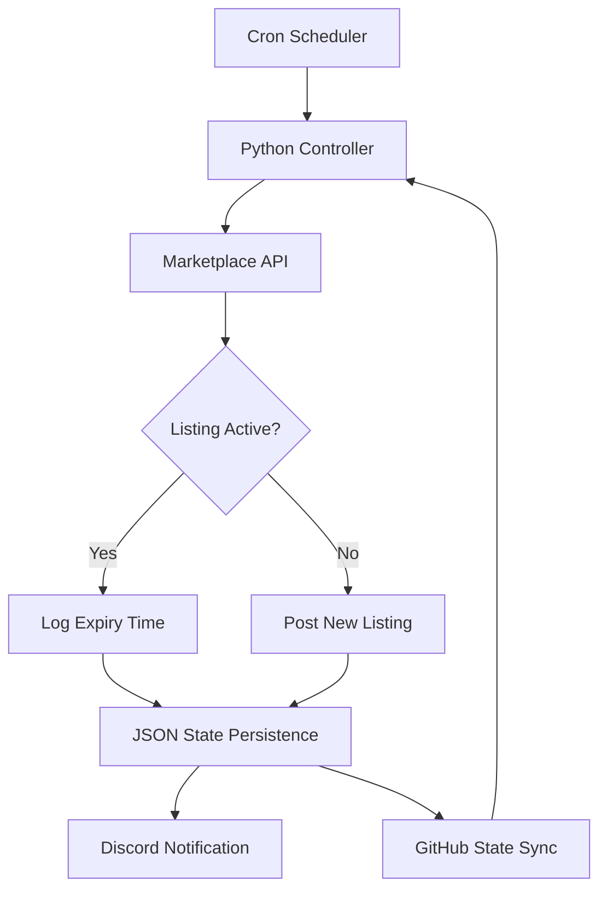

### Auto-Lister

---

## Features

### Bid Tracker
| Feature | Description |
|---|---|
| **Auto-Outbid** | Detects when a competitor beats your bid and automatically raises by exactly one price-tier increment |
| **Smart Underbid** | When winning by too much, lowers the bid to preserve capital while staying on top |
| **Min/Max Enforcement** | Configurable floor and ceiling per item — never bids outside the defined range |
| **Duplicate Cleanup** | On startup, finds and removes identical duplicate buy orders |
| **Stale Order Sync** | Cross-checks stored order IDs against the live API — recreates any that were filled or cancelled |
| **Adaptive Rate Limiting** | Exponential backoff with automatic recovery on API rate limit responses |
| **Cooldown System** | Automatic 8-hour cooldown with state preservation if bid limits are hit |
| **Discord Alerts** | Webhook notifications for bid updates, outbid events, and cooldown triggers |
| **Parallel Processing** | Concurrent item processing with per-item thread locks to prevent race conditions |
| **Watchdog Timer** | Background thread kills the process if runtime exceeds the safety threshold |
| **Self-Updating Config** | Rewrites item config in-place after each run with updated prices and order IDs |

### Auto-Lister
| Feature | Description |
|---|---|
| **Auto-Listing** | Detects unlisted inventory items and posts them to auction immediately |
| **Auto-Relist** | Monitors auction expiry and relists items within minutes of expiry |
| **State Persistence** | Full state committed to GitHub after every run — recoverable without a database |
| **Discord Embeds** | Rich embed summaries sent after every cycle |
| **24h Auction Cycle** | Items run as 24-hour auctions on a continuous loop |

---

## Security

- All credentials loaded from environment variables, never hardcoded
- API keys stored as GitHub Actions secrets, never exposed in logs
- Full output silenced in CI to prevent data leakage
- Repository encrypted at rest

---

## Lessons Learned

- Marketplace APIs can block requests from datacenter IP ranges — infrastructure choices matter early
- Delete-then-recreate patterns (no PATCH endpoint) require careful error handling to avoid orphaned state
- Regex-based config rewriting is fragile — JSON/structured config is the right long-term approach
- Rate limiting is not just about request frequency — cumulative bid volume over time windows matters too

---
