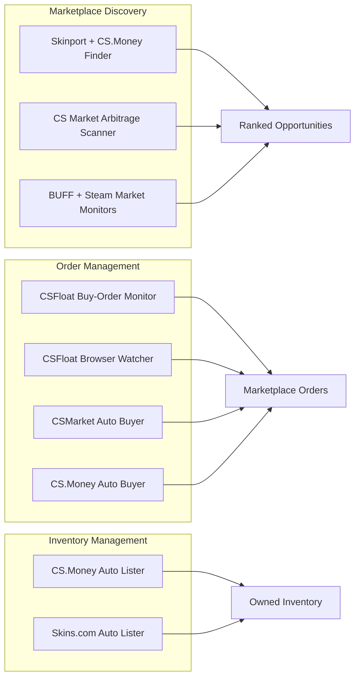
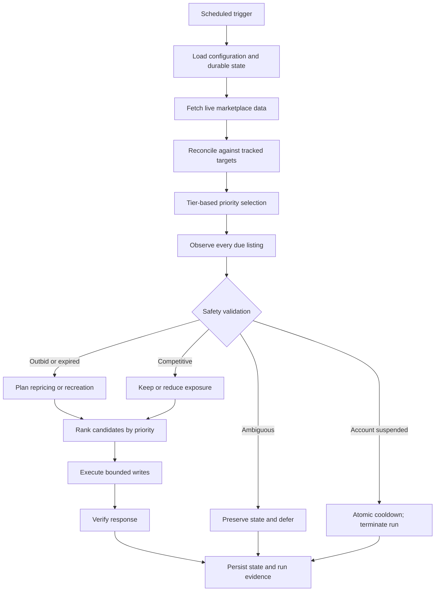

# CS2 Marketplace Trading System

A modular automation platform for CS2 marketplace trading, built with Python and JavaScript/Node.js. This repository contains the core buy-order monitor. The broader system coordinates 10+ services across order management, market discovery, inventory management, and deal analysis on CSFloat, CS.MONEY, Skinport, Skins.com, SkinSwap, BUFF, and the Steam Community Market.

## Architecture


```mermaid
flowchart LR
    subgraph "Marketplace Discovery"
        A["Skinport + CS.Money Finder"]
        B["CS Market Arbitrage Scanner"]
        C["BUFF + Steam Market Monitors"]
    end
    subgraph "Order Management"
        D["CSFloat Buy-Order Monitor"]
        E["CSFloat Browser Watcher"]
        F["CSMarket Auto Buyer"]
        G["CS.Money Auto Buyer"]
    end
    subgraph "Inventory Management"
        H["CS.Money Auto Lister"]
        I["Skins.com Auto Lister"]
    end

    D --> J["Marketplace Orders"]
    E --> J
    F --> J
    G --> J
    H --> K["Owned Inventory"]
    I --> K
    A --> L["Ranked Opportunities"]
    B --> L
    C --> L
```

Each service owns a narrow responsibility and produces durable run evidence. Failures remain isolated — a watcher outage cannot interrupt order maintenance, and a listing failure cannot corrupt buy-order state. A centralized supervisor orchestrates the full lifecycle: scheduling, process ownership, recovery after crashes, network-aware pauses, and coordinated shutdowns.


```mermaid
flowchart TD
    A["Scheduled trigger"] --> B["Load configuration and durable state"]
    B --> C["Fetch live marketplace data"]
    C --> D["Reconcile against tracked targets"]
    D --> E["Tier-based priority selection"]
    E --> F["Observe every due listing"]
    F --> G{"Safety validation"}
    G -->|"Outbid or expired"| H["Plan repricing or recreation"]
    G -->|"Competitive"| I["Keep or reduce exposure"]
    G -->|"Ambiguous"| J["Preserve state and defer"]
    G -->|"Account suspended"| K["Atomic cooldown; terminate run"]
    H --> L["Rank candidates by priority"]
    I --> L
    L --> M["Execute bounded writes"]
    M --> N["Verify response"]
    N --> O["Persist state and run evidence"]
    J --> O
    K --> O
```

## Buy-order management

### CSFloat Buy-Order Monitor

The core of the system. A Python platform built on mixin composition — `MarketMixin`, `ProcessingMixin`, `RuntimeMixin`, and `TierMixin` combine into a `MultiMonitor` that runs a continuous poll loop against CSFloat's marketplace API.

**Workflow:**

1. Load configuration across three tiers (hot/mid/cold) and durable runtime state
2. Fetch authoritative live orders from CSFloat's API
3. Reconcile configured targets against live orders, preserving ambiguous or in-flight state
4. Select due priority tiers — hot targets checked frequently, cold targets rotated less often
5. Observe every due listing before any writes begin
6. Plan the smallest valid update per target (reprice, recreate, retire, or hold)
7. Execute writes in priority order until work is exhausted or a rate limit trips the circuit breaker
8. Persist atomic state snapshots, tier movements, and structured run artifacts

**Key algorithms:**

- **Tiered scheduling** — targets promote or demote between hot/mid/cold based on recent activity, with mutation budgets preventing tier thrashing
- **Observation-first write scheduling** — every listing is observed before mutations begin; a global priority queue ranks safety corrections, outbids, missing-order repairs, and exposure reductions
- **Bid war escalation** — when a price approaches the configured maximum, incremental bid increases follow a diminishing-return curve
- **Fair observation cursor** — ensures each item gets equal observation time, preventing bias toward fast-updating listings
- **Branch-split detection** — detects when CSFloat splits variants (e.g., different stickers) and adjusts tracking accordingly

**Safety:**

- Circuit breaker on HTTP 429 — checkpoints state and defers all remaining mutations to the next run
- Account suspension detection (error code 138) — atomic 24-hour cooldown, immediate termination, persisted deadline
- 80-minute watchdog checkpoints state and pre-arms a one-run skip before the 85-minute hard timeout
- Atomic I/O — state written to temp files then renamed; previous snapshots retained for recovery
- Configurable via `strategy_settings.py` — write caps, observation caps, queue deferral, snapshot age

### Auto Buyers

The system includes two auto-buyer implementations covering CSFloat and CS.MONEY, sharing the same core loop: scan → match → validate → purchase → verify.

**CSMarket Auto Buyer (CSFloat API):**

- API-based scanner polling CSFloat's marketplace endpoints continuously
- Three modes: Fastest (19s solo), Dual (45s with Browser Watcher), Slow (40s solo)
- Paginates beyond the first 50-listing page, reading until the remembered-listing frontier
- HTTP 429 recovery ladder (60s → 300s → 600s → exit) with supervisor-applied retry guards
- Correlated shutdown contract — fresh result artifact, zero exit, exact process exit
- Shared 24-hour account suspension hold with the Browser Watcher
- Unclean-recovery ready marker after state validation and live offer reconciliation

**CS.Money Auto Buyer (Browser):**

- Playwright-driven browser scanner with a dedicated Chrome profile and dynamic CDP allocation
- 409-target / 8,175-branch policy with exact sticker identity, item identity, and pinned canonical weapon/paint data
- Sticker matching by ID set with penalty scoring for partial matches
- Low-float classification levels (e.g., "low", "very low") with configurable thresholds per weapon type
- Evidence digest — hash of target configuration for quick comparison and audit trail
- Dry-run default; live buying requires triple-armed configuration (`dry_run=false`, `live_runtime_enabled=true`, `live_purchasing_enabled=true`)
- Purchase lock prevents concurrent purchases; delivery cancellation monitor watches for marketplace removing bought items
- Child-owned recovery ladder (60s → 5min → 10min → 10min bounded)
- Target authorization approval flow; correlated shutdown with browser cleanup

**Shared patterns:**

- State persistence between runs via structured JSON
- Cooldown/rate limiting with progressive backoff
- Graceful shutdown with correlated result artifacts
- Unclean-recovery detection and reconciliation
- Network pause/resume with redundant markers

### CSFloat Browser Watcher

A Node.js/Playwright browser automation layer that controls a signed-in Chrome session on CSFloat, reads listing cards, evaluates demand, and places short-lived bargain offers.

- Reads visible listing cards, opens detail pages, parses demand rows, calculates edge
- Pump-risk detection with graph analysis and robust percentiles
- Balance policy refreshed before every scan; permanent cash reserve enforced
- Offer-rate pressure — curves up edge requirement as hourly limits fill
- Counter-accept and counter-back logic using dynamic session minimum edge
- Network pause/resume with in-flight markers
- Discord notifications for submissions, counters, and bargains

## Inventory management

### Auto Listers

Two auto-lister implementations mirror CSFloat inventory across CS.MONEY and Skins.com, sharing the same reconciliation loop: fetch source inventory → match against marketplace listings → create, update, or delist as needed.

**CS.Money Auto Lister:**

- Multi-account support with separate Chrome profiles and isolated state per account
- Item identity matching via asset IDs and market hash names between CSFloat and CS.Money
- Reconciliation compares current CSFloat state vs CS.Money state, delists items no longer on CSFloat
- Mass-delist guard prevents accidentally removing too many items at once
- Per-item outcome records: already_listed, listed, price_updated, extension_required
- Rate-limit timeout handling with bounded retries
- Verification grace period before confirming sales
- Browser tab cleanup — closes target pages after exit without killing shared Chrome

**Skins.com Auto Lister:**

- Multi-account support sharing infrastructure with CS.MONEY automations
- Two modes: calibration (first-run mapping) and normal (continuous monitoring)
- Identity matching between CSFloat and Skins.com item representations
- Decimal precision arithmetic for price calculations — avoids float rounding errors
- Mass-delist protection: minimum threshold, ratio limit, absolute cap
- Tab cleanup targeting skins.com pages while preserving unrelated tabs
- Per-item outcomes: already_listed, listed, delisted, price_updated, submitted_unverified

**Shared patterns:**

- Atomic file writes for runtime state with git sync for change tracking
- Mass-delist guards across both implementations
- Calibration verification required before production enablement
- Exclusive resource locking to prevent concurrent marketplace access

## Marketplace discovery

### Skinport + CS.Money Deal Finder

A daily two-stage browser workflow that scans Skinport and CS.Money for sticker deal opportunities, normalizes results, and publishes ranked alerts.

- Two independently runnable stages with split-stage recovery
- Component recovery — one marketplace's sign-in failure queues the other
- Repair actions for sign-in failures per marketplace
- Completion proof via timestamped JSON with per-check status records

### CS Market Arbitrage Scanner

A read-only scanner that compares listings from Skins.com, CS.MONEY, and SkinSwap against realistic CSFloat resale prices, writing ranked arbitrage reports.

- Three source marketplaces with dedicated Chrome profiles per source
- Immutable receipt-based run artifacts with digest verification
- Retry command that re-runs only failed sources from a prior receipt
- Read-only — no purchase, listing, or bid-write behavior

### Additional monitors

The system also includes monitors for BUFF and the Steam Community Market, evaluating currency-normalized opportunities and publishing compact summaries. These services are isolated from order maintenance — an alerting outage does not alter active bids.

## Reliability

| Failure condition | System response |
| --- | --- |
| Missing or malformed configuration | Reject the run before marketplace writes |
| Incomplete source response | Preserve prior state and record a failed result |
| Unknown order or listing outcome | Keep the item uncertain and refuse a duplicate submission |
| Authentication failure | Record an actionable failure without claiming successful work |
| Interrupted multi-stage scan | Preserve completed-stage evidence and resume only unfinished work |
| Missing or corrupt state | Restore a validated backup when available; otherwise fail closed |
| HTTP 429 (rate limit) | Checkpoint state and defer mutations to the next run |
| Account suspension | Atomic 24-hour cooldown, immediate termination, persisted deadline |

## Evidence and observability

The system distinguishes three evidence layers:

- **Durable runtime state** for reconciliation context, pending work, and last known authoritative observations
- **Structured run artifacts** containing explicit status, timestamps, mode, counts, and failure classifications
- **Human-readable logs** for detailed decisions and diagnostics

A process launch or a single log message is not treated as proof of successful work. Completion is based on a terminal run artifact plus internally consistent counts and timestamps.

## Technology

- **Python 3.13+** — orchestration, state transitions, data validation, APIs, testing
- **Node.js / Playwright** — browser automation for marketplace interaction
- **REST APIs** — orders, listings, pricing, and inventory
- **GitHub Actions** — scheduled execution and CI/CD
- **PowerShell** — local launchers and operational tooling
- **Structured JSON/JSONL** — run history, state snapshots, completion evidence
- **Git** — configuration publication and validated data synchronization

## Repository layout

```text
.
├── .github/                     # Scheduled and manual workflows
├── config/
│   ├── listings.py              # Primary configured targets
│   ├── listings_hot.py          # Active tier
│   ├── listings_mid.py          # Medium-frequency tier
│   └── manual_bids.py           # Explicit manual entries
├── data/
│   ├── state.json               # Durable monitor state
│   ├── outbid_stats.json        # Competitive-pressure history
│   ├── backups/                 # Historical listing/config and run backups
│   └── reference/               # Reference datasets and guides
├── sandbox/                     # Isolated live sandbox runner
├── tests/                       # Unit and regression tests
├── tools/                       # Manual operational/reporting utilities
├── src/market_monitor/
│   ├── monitor.py               # Main orchestration (MultiMonitor)
│   ├── monitor_market.py        # Market reads and comparison
│   ├── monitor_processing.py    # Per-target decisions
│   ├── monitor_runtime.py       # Runtime and watchdog boundaries
│   ├── monitor_tiers.py         # Tier movement and validation
│   ├── listing_loader.py        # Configuration loading and normalization
│   └── strategy_settings.py     # Central runtime controls
├── main.py                      # Production monitor entrypoint
└── requirements.txt
```

## Running

```bash
pip install -r requirements.txt
python main.py                          # Core monitor
python sandbox/test_file.py             # Isolated sandbox
python tools/show_losing_bids.py        # Read-only losing-bid report
python -X utf8 -m unittest discover -s tests -p "test_*.py"  # Tests
```

## Security

Credentials are supplied through runtime secrets, not source files. Sensitive configuration remains outside public documentation and is protected by the repository's encrypted configuration workflow. This README describes system boundaries and safety properties without publishing account details, private identifiers, bid values, or strategy thresholds.

The design prioritizes recoverability, bounded risk, failure isolation, and an auditable explanation for every automated decision.
