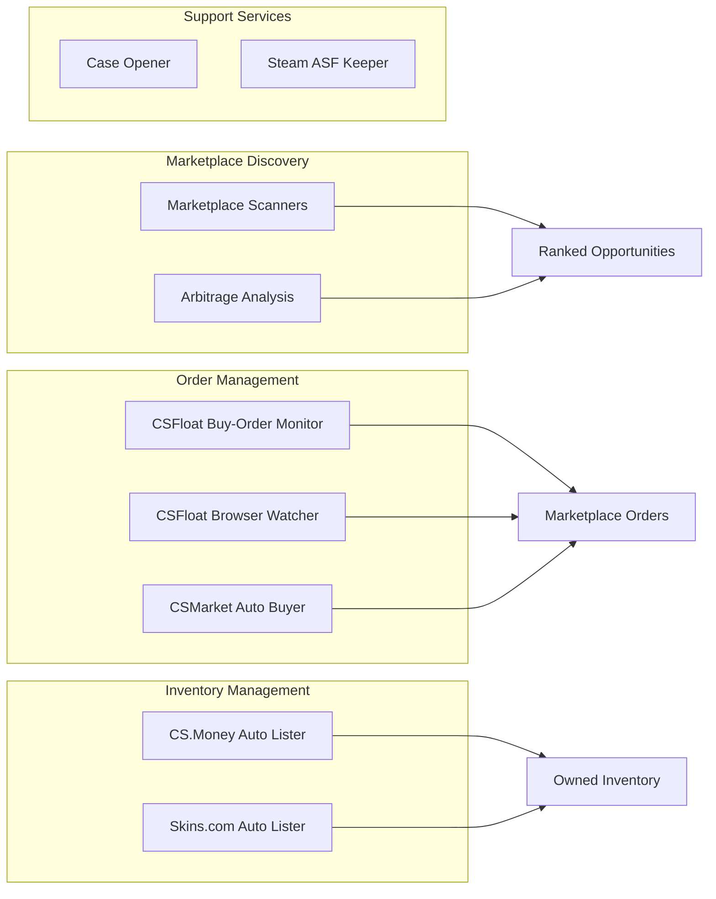

# CS2 Marketplace Trading System

A modular automation platform for CS2 marketplace trading, built with Python and JavaScript/Node.js. This repository contains the core buy-order monitor. The broader system coordinates 12+ services across order management, market discovery, inventory management, and deal analysis on CSFloat, CS.MONEY, Skinport, Skins.com, SkinSwap, BUFF, and the Steam Community Market.

## Architecture


```mermaid
flowchart LR
    subgraph "Marketplace Discovery"
        A["Marketplace Scanners"]
        B["Arbitrage Analysis"]
    end
    subgraph "Order Management"
        C["CSFloat Buy-Order Monitor"]
        D["CSFloat Browser Watcher"]
        E["CSMarket Auto Buyer"]
    end
    subgraph "Inventory Management"
        F["CS.Money Auto Lister"]
        G["Skins.com Auto Lister"]
    end
    subgraph "Support Services"
        H["Case Opener"]
        I["Steam ASF Keeper"]
    end

    C --> J["Marketplace Orders"]
    D --> J
    E --> J
    F --> K["Owned Inventory"]
    G --> K
    A --> L["Ranked Opportunities"]
    B --> L
```

Each service owns a narrow responsibility and produces durable run evidence. Failures remain isolated — a watcher outage cannot interrupt order maintenance, and a listing failure cannot corrupt buy-order state. A centralized supervisor orchestrates the full lifecycle: scheduling, process ownership, recovery after crashes, network-aware pauses, and coordinated shutdowns.

## Buy-order management

### CSFloat Buy-Order Monitor

The core of the system. A Python platform that maintains marketplace buy orders on CSFloat — polling active orders, detecting outbids, and automatically repricing or recreating bids to stay competitive.

- Tiered scheduling (hot/mid/cold) to concentrate expensive API checks on active targets
- Observation-first write scheduling with a global priority queue ranking safety corrections, outbids, and exposure reductions
- Circuit breaker on HTTP 429 — checkpoints state and defers mutations to the next run
- Account suspension detection with atomic 24-hour cooldown
- Temporary extra bids with paired main-suspension logic and backup recovery
- Market-aware protection — compares buy-now listings against the bid plan and tightens exposure when the market shifts
- Configurable via `strategy_settings.py` (write caps, observation caps, queue deferral, snapshot age)

### CSFloat Browser Watcher

A Node.js/Playwright browser automation layer that controls a signed-in Chrome session on CSFloat, reads listing cards, evaluates demand, and places short-lived bargain offers.

- Reads visible listing cards, opens detail pages, parses demand rows, calculates edge
- Pump-risk detection with graph analysis and robust percentiles
- Balance policy refreshed before every scan; permanent cash reserve enforced
- Offer-rate pressure — curves up edge requirement as hourly limits fill
- Counter-accept and counter-back logic using dynamic session minimum edge
- Network pause/resume with in-flight markers
- Discord notifications for submissions, counters, and bargains

### CSMarket Auto Buyer

A Python API scanner and purchase worker that continuously polls CSFloat's official listings API, matches configured targets, and executes buys.

- Three modes: Fastest (19s solo), Dual (45s with Browser Watcher), Slow (40s solo)
- Paginates beyond the first 50-listing API page
- HTTP 429 recovery ladder with supervisor-applied retry guards
- Correlated shutdown contract with fresh result artifacts
- Shared 24-hour account suspension hold with the Browser Watcher
- Unclean-recovery ready marker after state validation

### CS.Money Auto Buyer

A standalone browser scanner and purchase worker for CS.MONEY Market Mode using Playwright with a dedicated Chrome profile.

- 409-target / 8,175-branch policy with exact sticker identity and pinned canonical weapon/paint data
- Dry-run default; live buying requires triple-armed configuration
- Dynamic localhost CDP allocation with stable ordered-ID continuity
- Child-owned recovery ladder with bounded retries
- Runtime status and recovery-exhausted contracts
- Correlated shutdown with browser cleanup

## Inventory management

### CS.Money Auto Lister

An automated browser lister that reconciles owned CS.MONEY inventory, creates or renews listings, updates prices, and confirms sales.

- Multi-account support with separate Chrome profiles
- Browser tab cleanup — closes target pages after exit without killing shared Chrome
- Per-item outcome records: already_listed, listed, price_updated, extension_required
- Rate-limit timeout handling with bounded retries
- Verification grace period before confirming sales

### Skins.com Auto Lister

An automated browser lister for Skins.com that reconciles inventory, creates/delists/updates listings, and manages price synchronization.

- Multi-account support
- Shares infrastructure with CS.MONEY automations
- Tab cleanup targeting skins.com pages while preserving unrelated tabs
- Calibration listing verification required before production enablement
- Per-item outcomes: already_listed, listed, delisted, price_updated

## Marketplace discovery

### Skinport + CS.Money Deal Finder

A daily two-stage browser workflow that scans Skinport and CS.Money for sticker deal opportunities, normalizes results, and publishes ranked alerts.

- Two independently runnable stages with split-stage recovery
- Component recovery — one marketplace's sign-in failure queues the other
- Repair actions for sign-in failures per marketplace
- Completion proof via timestamped JSON with per-check status records
- Shared Chrome profiles with exclusive resource locking

### CS Market Arbitrage Scanner

A read-only scanner that compares listings from Skins.com, CS.MONEY, and SkinSwap against realistic CSFloat resale prices, writing ranked arbitrage reports.

- Three source marketplaces with dedicated Chrome profiles per source
- Immutable receipt-based run artifacts with digest verification
- Retry command that re-runs only failed sources from a prior receipt
- Discord notifications and Git publication of report history
- Read-only — no purchase, listing, or bid-write behavior

### Additional scanners

The system also includes monitors for BUFF and the Steam Community Market, evaluating currency-normalized opportunities and publishing compact summaries. These services are isolated from order maintenance — an alerting outage does not alter active bids.

## Support services

### Case Opener

Automates daily CS2 case openings across five signed-in Chrome profiles, reading Discord social codes, opening cases via Windows UI Automation, and tracking streaks.

- Opens cases for 5 Chrome profiles using the Windows accessibility tree
- Discord channel integration for social-code discovery with 48-hour deduplication
- 7th streak day bonus logic with profile-specific handling
- Cloudflare verification handling with three recovery rounds
- Account-specific Discord webhook notifications
- 24-hour cadence with opened/skipped/verification-blocked tracking

### Steam ASF Keeper

Manages an ArchiSteamFarm process to report CS2 as played across multiple Steam accounts, providing before/after proof verification — a prerequisite for the Case Opener's CS2 playtime requirement.

- Strict PID/creation-time/path/CLI isolation
- Per-account proof: before/after official Steam-recorded CS2 minutes comparison
- Hard invariants: ASF IPC on localhost only, banned port list, no browser automation
- DPAPI-protected secrets with current-user ACL on runtime directory
- 192 automated tests with verified live acceptance

## Reliability

| Failure condition | System response |
| --- | --- |
| Missing or malformed configuration | Reject the run before marketplace writes |
| Incomplete source response | Preserve prior state and record a failed result |
| Unknown order or listing outcome | Keep the item uncertain and refuse a duplicate submission |
| Authentication failure | Record an actionable failure without claiming successful work |
| Interrupted multi-stage scan | Preserve completed-stage evidence and resume only unfinished work |
| Missing or corrupt state | Restore a validated backup when available; otherwise fail closed |
| HTTP 429 (rate limit) | Checkpoint state and defer mutations to the next run |
| Account suspension | Atomic 24-hour cooldown, immediate termination, persisted deadline |

## Evidence and observability

The system distinguishes three evidence layers:

- **Durable runtime state** for reconciliation context, pending work, and last known authoritative observations
- **Structured run artifacts** containing explicit status, timestamps, mode, counts, and failure classifications
- **Human-readable logs** for detailed decisions and diagnostics

A process launch or a single log message is not treated as proof of successful work. Completion is based on a terminal run artifact plus internally consistent counts and timestamps.

## Technology

- **Python 3.13+** — orchestration, state transitions, data validation, APIs, testing
- **Node.js / Playwright** — browser automation for marketplace interaction
- **REST APIs** — orders, listings, pricing, and inventory
- **GitHub Actions** — scheduled execution and CI/CD
- **PowerShell** — local launchers and operational tooling
- **Structured JSON/JSONL** — run history, state snapshots, completion evidence
- **Git** — configuration publication and validated data synchronization

## Repository layout

```text
.
├── .github/                     # Scheduled and manual workflows
├── config/
│   ├── listings.py              # Primary configured targets
│   ├── listings_hot.py          # Active tier
│   ├── listings_mid.py          # Medium-frequency tier
│   └── manual_bids.py           # Explicit manual entries
├── data/
│   ├── state.json               # Durable monitor state
│   ├── outbid_stats.json        # Competitive-pressure history
│   ├── backups/                 # Historical listing/config and run backups
│   └── reference/               # Reference datasets and guides
├── sandbox/                     # Isolated live sandbox runner
├── tests/                       # Unit and regression tests
├── tools/                       # Manual operational/reporting utilities
├── src/market_monitor/
│   ├── monitor.py               # Main orchestration
│   ├── monitor_market.py        # Market reads and comparison
│   ├── monitor_processing.py    # Per-target decisions
│   ├── monitor_runtime.py       # Runtime and watchdog boundaries
│   ├── monitor_tiers.py         # Tier movement and validation
│   ├── listing_loader.py        # Configuration loading and normalization
│   └── strategy_settings.py     # Central runtime controls
├── main.py                      # Production monitor entrypoint
└── requirements.txt
```

## Running

```bash
pip install -r requirements.txt
python main.py                          # Core monitor
python sandbox/test_file.py             # Isolated sandbox
python tools/show_losing_bids.py        # Read-only losing-bid report
python -X utf8 -m unittest discover -s tests -p "test_*.py"  # Tests
```

## Security

Credentials are supplied through runtime secrets, not source files. Sensitive configuration remains outside public documentation and is protected by the repository's encrypted configuration workflow. This README describes system boundaries and safety properties without publishing account details, private identifiers, bid values, or strategy thresholds.

The design prioritizes recoverability, bounded risk, failure isolation, and an auditable explanation for every automated decision.
